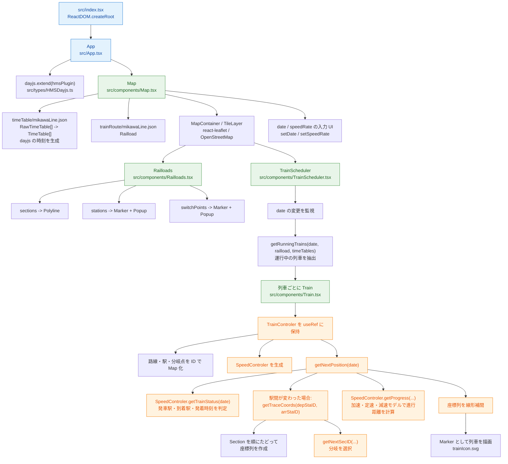

# 路線時刻表可視化アプリ 仕様書

この README は、src 配下の TypeScript 実装をもとに、アプリの責務・データ構造・画面動作・列車位置計算の仕様を整理したものです。

## 1. 概要

本アプリは、地図上に路線と列車を描画し、現在時刻または任意の時刻に合わせて各列車の位置を表示する React + TypeScript アプリです。

主な機能は次のとおりです。

- OpenStreetMap を背景地図として表示する
- 路線データから駅・線路・分岐点を地図に描画する
- 時刻表 JSON から各列車の発着時刻を読み込む
- 現在時刻を基準に「運行中の列車」を抽出する
- 各列車を、加速・等速・減速の運行モデルで位置計算し表示する
- 日時入力と再生速度のスライダーを通して時刻を操作できる

---

## 2. 実行時の基本構成

### 2.1 エントリーポイント

- [src/App.tsx](src/App.tsx)
  - アプリの最上位コンポーネント
  - [src/components/Map.tsx](src/components/Map.tsx) を描画するだけ

- [src/index.tsx](src/index.tsx)
  - React のルートとして App をマウントする

### 2.2 画面構造

- [src/components/Map.tsx](src/components/Map.tsx) が全体の画面を制御する
- 下記をまとめて描画する
  - 路線の線分と駅・分岐点のマーカー
  - 運行中列車の Marker
  - 時刻と速度を設定する UI

### 2.3 エントリポイントからのプログラム樹形図

実行時の呼び出し関係は次のとおりです。`Map` は画面全体とデータ変換を担当し、列車の位置計算は `Train` 内部のクラスが担当します。



補足:

- `src/types/*` は型定義と `dayjs` プラグインを提供します。型定義自体は実行時の呼び出し先ではありません。
- [src/components/LoadJson.tsx](src/components/LoadJson.tsx) の `LoadJson` は、現在の実装ではどのコンポーネントからも呼び出されていません。データは `Map.tsx` の JSON import で読み込まれます。

---

## 3. 画面とユーザー操作

### 3.1 地図表示

Map コンポーネントは react-leaflet の MapContainer を使って地図を表示し、初期位置は次の値で設定されます。

- 中心座標: 35.0056828, 137.0397465
- ズーム: 16
- 最大ズーム: 21

背景地図には OpenStreetMap のタイルを使います。

### 3.2 時刻と速度制御

Map コンポーネントの state は次の通りです。

- `date`: 現在表示中の時刻 (`dayjs.Dayjs`)
- `speedRate`: 時間の進み方の倍率 (`number`)

処理の流れ:

1. `useEffect` で `frameRate = 30ms` ごとに `date` を更新する
2. `speedRate` に応じて 1, 2, 5, 10, 60 倍で進行させる
3. フォームの `datetime-local` で任意時刻を編集可能
4. `<select>` で再生速度を切り替え可能

---

## 4. データソースと変換

### 4.1 路線データ

- 読み込み元: `trainRoute/mikawaLine.json`
- 型: [src/types/railload.ts](src/types/railload.ts)

この JSON は `Railload` 型に対応し、次を持つ構造です。

- `sections: Section[]`
- `stations: Station[]`
- `switchPoints: SwitchPoint[]`

#### Section

```ts
interface Section {
  id: string;
  prev: string;
  next: string;
  distance: number;
  coords: number[][];
  dist_coords: number[];
}
```

- 路線区間を表す
- `coords` は 緯度経度 の座標列
- `dist_coords` は 各座標までの累積距離

#### Station

```ts
interface Station {
  id: string;
  name: string;
  name_en: string;
  code: string;
  prev: string;
  next: string;
  coord: number[];
}
```

- 駅情報
- `coord` は駅の緯度経度
- `prev` / `next` はその駅に接続する section の ID

#### SwitchPoint

```ts
interface SwitchPoint {
  id: string;
  coord: number[];
  direction: way[];
}
```

- 分岐点情報
- `direction` は「どの section から来て、どの section に進むか」の分岐ルール

### 4.2 時刻表データ

- 読み込み元: `timeTable/mikawaLine.json`
- 型: [src/types/timeTable.ts](src/types/timeTable.ts)

`RawTimeTable` を受け取り、Map コンポーネント上で次の変換を行う:

- `a`/`d` 文字列を `dayjs` オブジェクトへ変換
- `RawTimeTable[]` から `TimeTable[]` に変換

```ts
interface TimeTable {
  line: string;
  trainNo: string;
  fromSta: string;
  fromStaId: string;
  toSta: string;
  toStaId: string;
  bound: boolean;
  tt: Dia[];
}
```

`Dia` は各駅停車の出発/到着時刻を持つ。

```ts
interface Dia {
  s: string;
  a: dayjs.Dayjs;
  d: dayjs.Dayjs;
}
```

---

## 5. 主要コンポーネント

### 5.1 Railloads

- ファイル: [src/components/Railloads.tsx](src/components/Railloads.tsx)
- 役割: 路線データを地図上に可視化する

描画内容:

- `sections` を `Polyline` として描画
- `stations` を `Marker` として描画
- `switchPoints` を `Marker` として描画

各要素には `Popup` で `section.id` や `station.id` が表示される。

### 5.2 TrainScheduler

- ファイル: [src/components/TrainScheduler.tsx](src/components/TrainScheduler.tsx)
- 役割: 現在時刻に合致する列車を選び、表示対象とする

`getRunningTrains(date, railload, timeTables)` で列車を判断する。

判定条件:

- 列車の発車時刻 `d` 以降
- 列車の到着時刻 `a` より前

つまり、時刻が列車の運行区間の内側に入っている列車を running とみなす。

`trains` は state として保持され、毎回 `date` 変更時に再計算される。

### 5.3 Train

- ファイル: [src/components/Train.tsx](src/components/Train.tsx)
- 役割: 個別列車の位置を計算して Marker として描画する

列車ごとに `TrainControler` を生成し、以下を保持する:

- 路線の section マップ
- 駅マップ
- 分岐点マップ
- 路線上の座標列 `traceCoords`
- 路線上での累積距離 `traceDists`
- 運行方向 `isInBound`
- `SpeedControler`

列車位置は `getNextPosition(date)` で計算される。

---

## 6. 列車位置計算の仕様

### 6.1 運行状態の判定

`SpeedControler.getTrainStatus(date)` は、現在時刻から列車の状態を次のように判定する:

- 始発前: 始発駅に停車中とみなす
- 終着後: 終着駅に停車中とみなす
- 駅間走行中: 発駅と着駅が異なる
- 駅停車中: 同一駅に停車している

返り値:

```ts
[string, string, dayjs.Dayjs, dayjs.Dayjs]
```

- 発駅 ID
- 着駅 ID
- 発車時刻
- 到着時刻

### 6.2 走行距離の計算

`getProgress(date, depTime, arrTime, distance)` では駅間距離 `distance` を入力として、進行割合を計算する。

- 運行時間: `arrTime.diff(depTime, 'millisecond')`
- 加速時間: `this.accelTime = 2 * 1000` ms
- 速度モデル: 加速 → 等速 → 減速

進行距離は次の式で計算される。

- 定速速度: $v = \frac{distance}{travelTime - accelTime}$
- 加速区間: $progress = \frac{v \cdot elapsedTime^2}{2 \cdot accelTime}$
- 等速区間: $progress = \frac{accelTime \cdot v}{2} + v \cdot (elapsedTime - accelTime)$
- 減速区間: $progress = distance - \frac{v \cdot (travelTime - elapsedTime)^2}{2 \cdot accelTime}$

この計算により、駅間での位置が「進行率」として得られる。

### 6.3 軌跡座標の生成

`TrainControler.getTraceCoords(depStaID, arrStaID)` は、発駅から着駅までの線路座標列を構築する。

処理の流れ:

1. 発駅を起点として、向きに応じて `next` または `prev` の section を辿る
2. section の `coords` を連結する
3. 分岐点で `switchPoint.direction` を参照し、到着駅に応じて次 section を選択する
4. 着駅に到達した時点で終了する

`traceCoords` と `traceDists` の両方を保持し、各座標が「駅からの距離」でどう表されるかを管理する。

### 6.4 位置補間

`getNextPosition(date)` では、現在の進行距離 `progress` をもとに、`traceCoords` の 2 点間で線形補間を行う。

- `prevTraceCoord`: 直前の座標
- `nextTraceCoord`: 直後の座標
- `miniDist`: 2 点間の距離
- `progressRate`: 進行率

補間計算:

$$
progressRate = \frac{progress - prevTraceDist}{miniDist}
$$

$$
newPosition = prevTraceCoord + (nextTraceCoord - prevTraceCoord) \cdot progressRate
$$

これにより、列車は地図上で滑らかに移動する。

---

## 7. 分岐制御

分岐点は `direction` をもつ。

```ts
interface way {
  from: string;
  to: string;
  condition: string[] | string;
}
```

仕様:

- `from` に現在通過中の section ID を一致させる
- `condition === "none"` の場合は無条件で進む
- `condition` が string[] の場合は、目的駅 ID が含まれているものを採用する

`TrainControler.getNextSecID(switchPoint, prevSecID, desStaID)` がこの判定を担当する。

---

## 8. dayjs 拡張

- ファイル: [src/types/HMSDayjs.ts](src/types/HMSDayjs.ts)

`dayjs.extend(hmsPlugin)` により、以下のメソッドが追加される:

- `isHMSAfter`
- `isHMSBefore`
- `isHMSSame`
- `isHMSSameOrAfter`
- `isHMSSameOrBefore`
- `hmsDiff`
- `getMinuteFromDay`

これにより、日付をまたぐ時刻比較を `HH:mm:ss` に限定した比較で処理できる。

---

## 9. 実際のデータフロー

1. `Map` が JSON を読み込む
   - `timeTable/mikawaLine.json` → `RawTimeTable[]`
   - `trainRoute/mikawaLine.json` → `Railload`
2. `Map` が `dayjs` に変換し `TrainScheduler` に渡す
3. `TrainScheduler` が `date` を見て運行中列車を抽出する
4. `Train` が各列車の `TrainControler` を生成する
5. `TrainControler` が `getTrainStatus` と `getProgress` で列車位置を算出する
6. `Marker` として Leaflet 地図上に表示する

---

## 10. 仕様上の制約と注意点

- `TrainScheduler` の依存は時刻表にのみ基づいており、列車ごとに `date` 変更時に再計算される
- `Train` の `TrainControler` は `useRef` に保持されるため、再レンダリング時に位置計算の状態を維持する
- `getTrainStatus` の判定では、始発前・終着後・停車中を明示的に分岐している
- 分岐点の選択は `switchPoint.direction` の `condition` に依存するため、データの正しさが列車の進路制御の鍵になる
- 地図上の座標は JSON の `coords` をそのまま使うので、実路線の補正精度が重要

---

## 11. まとめ

本アプリは、「地図上に路線を描画し、時刻表に基づいて列車の位置を計算して可視化する」ことを主目的とする React + Leaflet アプリです。

特に本実装の中核は次の 3 点です。

- 路線・駅・分岐点の地図データを構造化して持つこと
- 時刻表と現在時刻から運行中列車を抽出すること
- 加速・等速・減速の速度モデルと線形補間で列車位置を計算すること

これらにより、固定的な経路ではなく、時刻に応じた「列車の動き」をアニメーション風に再現している。
    style TrainScheduler fill:#c8e6c9
    style Train fill:#f3e5f5
    style TC fill:#ffe0b2
    style SC fill:#ffe0b2
    style JSON1 fill:#a5d6a7
    style JSON2 fill:#a5d6a7
```
各コンポーネントの役割を以下に示す
* Map
  UIを担当．Leafletライブラリを読み込みOSMを表示し，時刻の進む速度や表示する日付を受け取り，子コンポーネントに渡す
  子コンポーネントで共通で使用するデータはここでフェッチしてpropで渡す
* Railloads
  OSM上に路線や駅の位置を線やアイコンで示す
* TrainScheduler
  時刻表に従ってスポーンさせる列車とデスポーンする列車の管理を行う
  * Train
    Leafletのアイコンとして時刻に応じた位置に列車を示すアイコンを置く
  * TrainController
    SpeedControllerが出力した進行度を地図情報に落とし込み，緯度と経度を算出する．
  * SpeedController
    随時時刻を受け取り，時刻表から列車が何駅の間にいるのか，出発駅からどこまで進んでいるかを出力する
