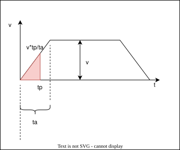
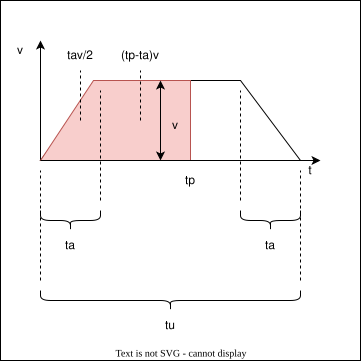
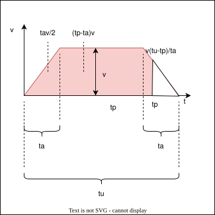
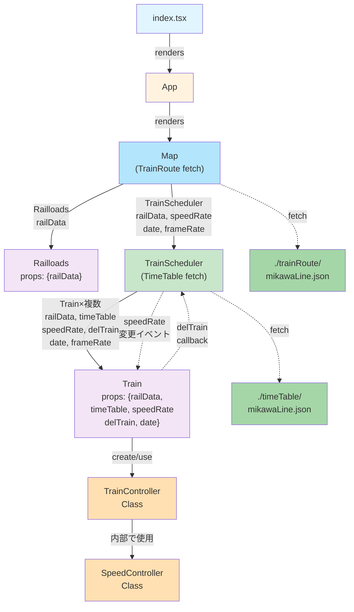

# このプログラムの目的
* OpenStreetMap上に時刻と同期した列車の位置を表示する
* ユーザは任意の時刻及び時刻の進む速度をWeb上のUIで設定でき，列車は設定した時刻に対応した位置に表示される

# 用語の定義
このプログラム上で用いる用語をまとめる．
* Station
  路線上にあるホーム
* Stations
  Stationを路線ごとに配列にしたもの
* SwitchPoint
  線路上にある分岐点
* SwitchPoints
  SwitchPointを路線ごとに配列にしたもの
* Section
  始点と終点がStationもしくはSwitchPointとなるように切り分けられた線路の座標の配列
* Sections
  Sectionを路線ごとに配列にしたもの
* TimeTable
  路線全体の列車ごとに記述された時刻表
* TraceCoords
  ある列車の出発Stationから到着Stationを結ぶ線路の座標の配列．Sectionsから切り出して連結する．
* SpeedControler
  時刻を入力とし，列車がそのStation間におり，全体の何割の位置にいるかを返して列車の進行速度を制御する
  


# 速度制御の方法
駅から駅までの速度変化の流れを加速，等速，減速の3段階のみで行い，加速時間と減速時間は等しいとする．駅間の運行時間 $t_u$，電車の加減速時間$t_a$，駅間の距離$x_u$，等速時の速度$v$とすると，$v-t$グラフは台形となる．


速度と距離の関係から$v-t$グラフの台形の面積は駅間(TraceCoords)の距離$x_u$となる．
$$
x_u=\frac{\{(t_u-2t_a)+t_u\}\cdot v}{2}=(t_u-t_a)v
$$

$t_u$は時刻表から読み取れるので既知，$t_a$は任意で決められる値とする，$x$は地図から求められる値なので既知なので残る$v$を求める式に変形すると
$$v=\frac{x}{t_u-t_a}$$
以上により，等速時の速度が求められた．
また，加減速時の加速度は$a$は
$$a=\frac{v}{t_a}$$
で求められる．

出発時間から表示時間までの経過時間$t_p$で列車が出発駅からどこまで進んだかを求めることが出来る．
1. $t_p<t_a$のとき(加速時間)の走行距離$x_1$
   底辺$t_p$，高さ$v\frac{t_p}{t_a}$の直角三角形の面積
   $$
      x_1=\{t_p\times v\frac{t_p}{t_a}\}\times\frac{1}{2}
   $$
   
2. $t_a<=t_p<t_u-t_a$のとき(等速時間)の走行距離$x_2$
   底辺$t_a$，高さ$v$の直角三角形と底辺$t_p-t_a$，高さ$v$の長方形の面積の和
   $$
      x_2=\frac{t_av}{2}+(t_p-t_a)v
   $$
   
3. $t_p<=t_u-t_a$のとき(減速時間)の走行距離$x_3$
   台形である駅間距離$x_u$から底辺$t_u-t_p$，高さ$v\frac{t_u-t_p}{t_a}$を引いた面積
   $$
      x_3=x_u-\{(t_u-t_p)\times v\frac{t_u-t_p}{t_a}\}\times \frac{1}{2}
   $$
   
# 列車の進め方

列車は出発駅からの距離から該当する線路座標を算出して移動する．列車の次の座標はTraceCoordsの座標を元に線形補完を用いて算出する．

この場合は隣り合ったchckPoint間で計算が完了する．用いる変数とその役割を示す．


| 変数          | 説明 |
|-              |-|
|distToMove     | 列車が次の画面描画までに進行する距離 |
|position       | 列車の現在位置|
|newLat/newLng  | positoinからdistToMoveだけ動いた後の座標 |
|prevTraceCoord | positionより手前のTraceCoord|
|nextTraceCoord | positionより先のTraceCoord|
|distTraceCoord | prevTraceCoordとnextTraceCoord間の距離|
|distToPrev     | positionとprevTraceCoord間の距離|

1. 列車が移動した結果TraceCoord間の中でどこまで進んだかという割合をprogressRateとして求める
    $$progressRate=\frac{distToPrev+distToMove}{distTraceCoord}$$
2. prevTraceCoordを原点としたときの移動後の座標を求めるために，prevTraceCoordとnextTraceCoordそれぞれの緯度・経度の差分にprogressRateを掛ける
   $$(nextTraceCoord-prevTraceCoord)\cdot progressRate$$
3. 2.の結果にprevTraceCoordを足して原点を元に戻す
   $$newPosition=prevTraceCoord+(nextTraceCoord-prevTraceCoord)\cdot progressRate$$

# 分岐選択の方法
すべてのSwitchPointsは座標と一緒にそれぞれの分岐の先にどの駅のどのホームに接続されているかの情報を持っている．
列車のTimeTableから到着駅の情報を参照し，合致する方向を選択する．


# データ構造
## 路線データ
```json
{
  "sections":[
    {
      "id": "MU11_1-MU11_A", //SectionのID
      "prev": "MU11_1", //下り方面のSwitchPointもしくはStationのID
      "next": "MU11_A", //上り方面のSwitchPointもしくはStationのID
      "distance": 0.0009609966630519959, //Sectionの距離
      "coords": [ //Sectionを構成する座標の配列
        [
            34.8738334,
            136.9855133
        ],
        [
            34.8740131,
            136.9855243
        ],
        [
            34.8742276,
            136.9855543
        ],
        [
            34.8744058,
            136.9856086
        ],
        [
            34.8747605,
            136.9857395
        ]
      ]
    }
    :
  ],
  "stations":[
    {
      "id": "MY11_1", //stationのID<駅コード>_<ホーム番号>
      "name": "猿投", //駅名(日本語)
      "name_en": "Sanage", //駅名(英語)
      "code": "MY11", //駅コード
      "prev": "MY11_C-MY11_1", //下り方向のsectionID
      "next": "MY11_1-MY11_B", //上り方向のsectionID
      "coord": [ //staionの座標
        35.1221836,
        137.1786511
      ]
    }
    :
  ],
  "switchPoints":[
    {
        "id": "MU11_A", //switchPointのID<付近の駅コード>_<通しアルファベット>
        "coord": [ //switchPointの座標
            34.8747605,
            136.9857395
        ],
        "direction": [ //分岐ルール
          { //sectionID"MU11_2-MU11_A"から来た場合は無条件で"MU11_A-MU10_1"方向へ
              "from": "MU11_2-MU11_A",
              "to": "MU11_A-MU10_1",
              "condition": "none"
          },
          { //sectionID"MU11_1-MU11_A"から来た場合は無条件で"MU11_A-MU10_1"方向へ
              "from": "MU11_1-MU11_A",
              "to": "MU11_A-MU10_1",
              "condition": "none"
          },
          { //sectionID"MU11_A-MU10_1"から来て到着駅が"MU11_2"の場合は"MU11_A-MU10_1"方向へ
              "from": "MU11_A-MU10_1",
              "to": "MU11_2-MU11_A",
              "condition": [
                  "MU11_2"
              ]
          },
          { //sectionID"MU11_A-MU10_1"から来て到着駅が"MU11_1"の場合は"MU11_1-MU11_A"方向へ
              "from": "MU11_A-MU10_1",
              "to": "MU11_1-MU11_A",
              "condition": [
                  "MU11_1"
              ]
          }
      ]
    },
  ]
}
```

## Timetable
# コンポーネント

各コンポーネントの役割を以下に示す
* Map
  UIを担当．Leafletライブラリを読み込みOSMを表示し，時刻の進む速度や表示する日付を受け取り，子コンポーネントに渡す
  子コンポーネントで共通で使用するデータはここでフェッチしてpropで渡す
* Railloads
  OSM上に路線や駅の位置を線やアイコンで示す
* TrainScheduler
  時刻表に従ってスポーンさせる列車とデスポーンする列車の管理を行う
  * Train
    Leafletのアイコンとして時刻に応じた位置に列車を示すアイコンを置く
  * TrainController
    SpeedControllerが出力した進行度を地図情報に落とし込み，緯度と経度を算出する．
  * SpeedController
    随時時刻を受け取り，時刻表から列車が何駅の間にいるのか，出発駅からどこまで進んでいるかを出力する
