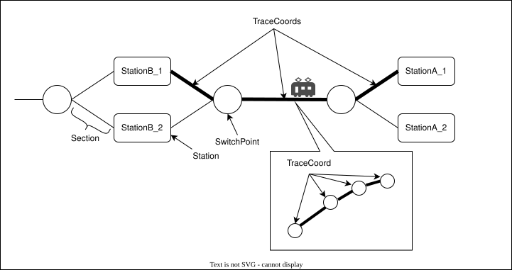
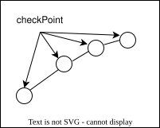
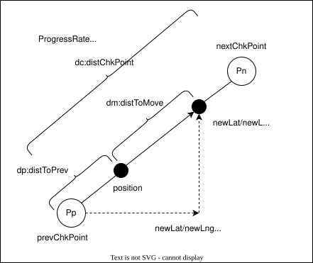
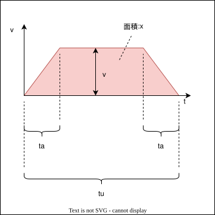
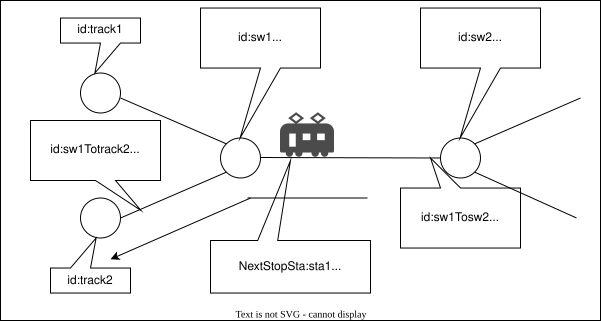

# 用語の定義
このプログラム上で用いる用語をまとめる．

路線はホームを表すTrack，分岐器を表すSwitch，それらを結ぶSectionで構成されている．列車が駅から駅まで通過する区間は複数のSectionを連結させ，これをrailChkPointsと呼ぶ．

Sectionは緯度経度(座標)の配列である．配列の各要素をCheckPointと呼ぶ．

# 列車の進め方
列車は次に進む距離を指定され，その距離を進んだ先の座標を算出して移動していく．次の座標はCheckPointの座標を元に線形補完を用いて算出する．

この場合は隣り合ったchckPoint間で計算が完了する．用いる変数とその役割を示す．

| 変数          | 説明 |
|-              |-|
|distToMove     | 列車が次の画面描画までに進行する距離 |
|position       | 列車の現在位置|
|newLat/newLng  | positoinからdistToMoveだけ動いた後の座標 |
|prevCheckPoint | positionより手前のcheckPoint|
|nextCheckPoint | positionより先のcheckPoint|
|distChkPoint   | prevChkPointとnextChkPoint間の距離|
|distToPrev     | positionとprevChkPoint間の距離|

1. 列車が移動した結果chkPoint間の中でどこまで進んだかという割合をprogressRateとして求める
    $$progressRate=\frac{distToPrev+distToMove}{distChkPoint}$$
2. prevCheckPointを原点としたときの移動後の座標を求めるために，prevCheckPointとnextCheckPointそれぞれの緯度・経度の差分にprogressRateを掛ける
   $$(nextCheckPoint-prevCheckPoint)\dot progressRate$$
3. 2.の結果にprevChkPointを足して原点を合わせる
   $$newLat/newLng=prevCheckPoint+(nextCheckPoint-prevCheckPoint)\cdot progressRate$$

# 速度制御の方法
駅から駅までの速度変化を加速，等速，減速のみとし，加速時間と減速時間は等しいとする．駅間の運行時間 $t_u$，電車の加減速時間$t_a$，駅間の距離$x$，等速時の速度$v$とすると，$v-t$グラフは台形となり，その面積が駅間の距離となる．

$$\frac{\{(t_u-2t_a)+t_u\}\cdot v}{2}=x$$
$t_u$は時刻表から読み取れるので既知，$t_a$は任意で決められる値とする，$x$は地図から求められる値なので既知なので残る$v$を求める式に変形すると
$$v=\frac{x}{t_u-t_a}$$
以上により，等速時の速度が求められた．また，加減速時の加速度は$a$は
$$a=\frac{v}{t_a}$$
で求められる．
# 分岐選択の方法
SectionもSwitchもそれぞれがidを持っている．Sectionは前後のSectionまたはSwitchのidをnext，prevという属性で持っている．Sectionは右または左へ向かう条件と左右へ曲がった先のSectionのidが定義されている．TrainはSectionの座標を取り込んでいく最中にSwitchオブジェクトに差し掛かった際は，自身の運行情報（次の駅の何番線に停車するか，通過するか，路線を跨ぐのか等）とSwitchの条件とを比較し，右または左のSectionのidを選択し，取り込んでいく．
